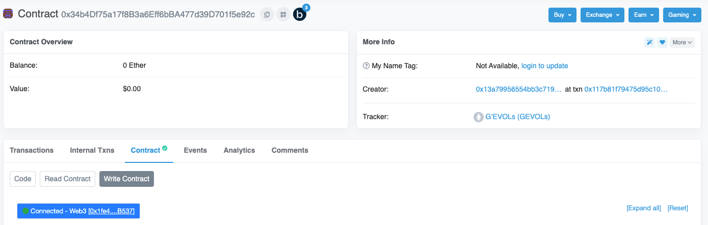

# Contract Minting

.png>)

Minting an NFT is the action of creating your unique token on the blockchain. Even when you’re minting your NFT from a new project’s website, you’re interacting with the underlying smart contract to mint your unique NFT.

But when the website gets bogged down with traffic on a hyped drop and isn’t working, how do you mint an NFT from the smart contract on Etherscan?

Keep in mind that these steps are not the same for every smart contract. You will need to find the correct contract function to mint the NFT.

Every contract is different, and the blockchain is irreversible, so always be sure to double-check all transactions before confirming.

**Find the Smart Contract on Etherscan**&#x20;

The first thing you need to do to mint an NFT directly from a smart contract is find the contract address. It should look something like this, though every contract is different: 0xBC4CA0EdA7647A8aB7C2061c2E118A18a936f13D.

Most projects have them listed on their website or in their Discord. If a project has been minted the contract can be found through OpenSea by clicking on any NFT that has been minted and opening the “Details” section. Click on the contract address to take you to Etherscan.

If you only have the contract address and not the link to Etherescan, go to Etherscan.io and search by the contract address.

 (1).png>)

**Write Contract and Connect to Web 3**&#x20;

Once on the Contract page you will need to push the Contract button near the bottom bringing up Code, Read Contract, and Write Contract. Here, you will select the Write Contract option.

Write Contract will bring up several options that execute a function defined on the smart contract.

.png>)

With the Write Contract button selected, click the Connect to Web3 button and connect your wallet.

If you have multiple wallets or accounts, make sure to connect the wallet you want to hold this NFT so you don’t have to pay gas transferring it later.

.png>)

**Mint your NFT from the Smart Contract**&#x20;

The final step of the process is to mint your new NFT.

Once your wallet is connected you will need to expand the minting category, in this example of Pineapple’s Day Out it is option four. mintPineapple. However, every smart contract is different.

.png>)

Expanding the “mintPineapple” will give you the option to mint. Insert the mint price in the first box (.02 ETH, in this case) and the number you would like to mint in the second box.

If you wanted to mint two pineapples, you would type .04 / 2; for three, .06 / 3… and so on.

.png>)

**Most important part**&#x20;

triple check your inputs to ensure they matchup with the project price and your number of tokens. The blockchain is trustless, so it relies on you to ensure everything is correct. Click on the Write button and sign the transaction on your wallet to complete the transaction.

**Benefits**&#x20;

There are many benefits to knowing how to mint from a smart contract, and that’s why many sharp NFT collectors use this method to stack NFTs of a hyped release.

First, you’ll be able to bypass connecting your wallet to many different websites — instead connecting safely to a secure smart contract. Second, you will have immediate access to the smart contract when it is turned live, meaning you may mint faster than those looking on the website. Third, you don’t have to trust that the website will work.
